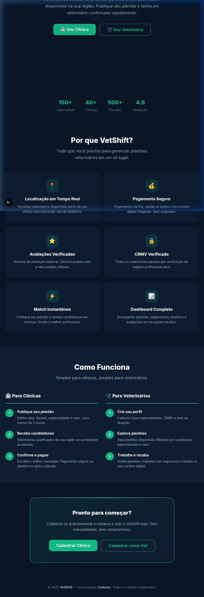
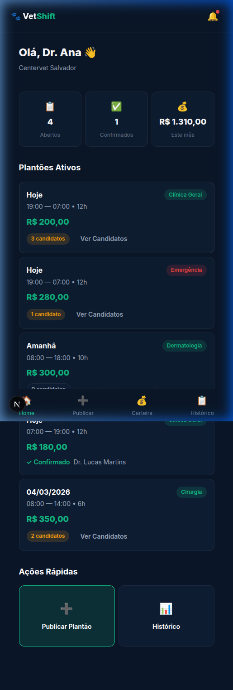
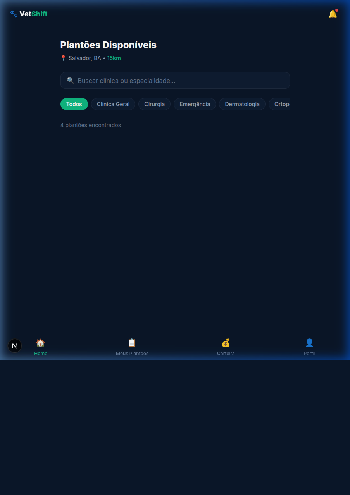
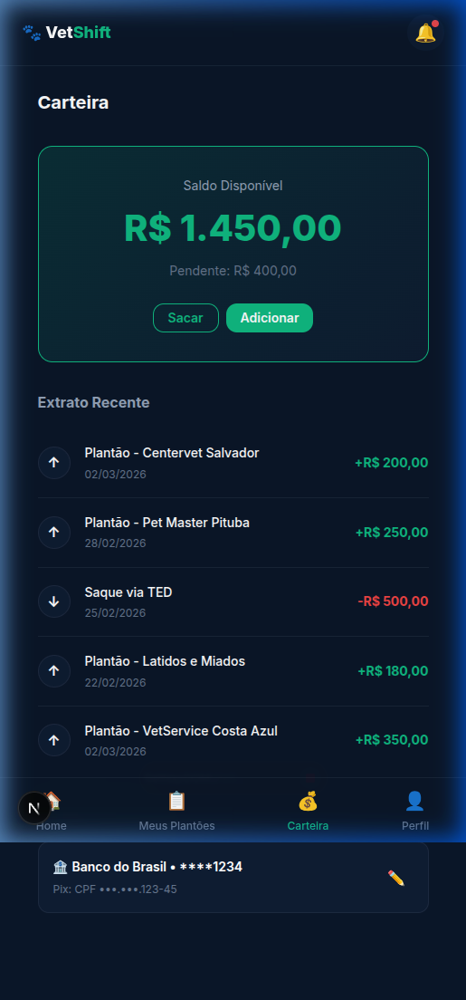
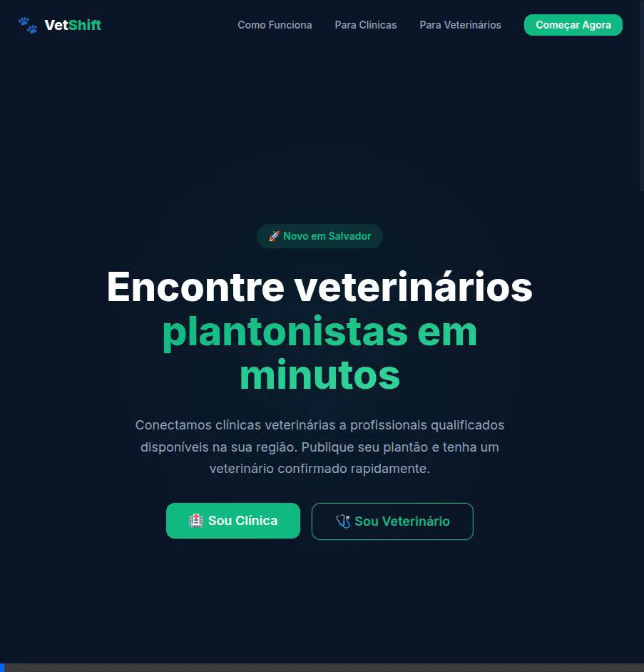

<p align="center">
  <h1 align="center">🐾 VetShift</h1>
  <p align="center">
    <strong>O marketplace de plantões veterinários do Brasil</strong>
  </p>
  <p align="center">
    
    
    
    
    
  </p>
  <p align="center">
    Conectamos clínicas veterinárias a profissionais plantonistas qualificados em minutos.
  </p>
  <p align="center">
    <a href="#features">Features</a> •
    <a href="#tech-stack">Tech Stack</a> •
    <a href="#getting-started">Getting Started</a> •
    <a href="#screenshots">Screenshots</a> •
    <a href="#roadmap">Roadmap</a>
  </p>
</p>

---

## 💡 O Problema

Clínicas veterinárias precisam de plantonistas de última hora. Veterinários querem flexibilidade para escolher quando e onde trabalhar. Hoje, essa conexão acontece por WhatsApp, indicações informais e muita fricção.

## 🚀 A Solução

**VetShift** é um marketplace que conecta clínicas e veterinários plantonistas em tempo real — como um Uber para plantões veterinários.

- Clínicas publicam plantões com 1 clique
- Vets veem ofertas filtradas por localização, especialidade e valor
- Match, aceite, trabalhe e receba — tudo pela plataforma

---

## <a name="features"></a>✨ Features

### Para Clínicas 🏥
- **Publicar plantão** — Especialidade, data, horário, valor e requisitos
- **Dashboard** — Plantões abertos, confirmados e gastos do mês
- **Ver candidatos** — Perfil, avaliação e histórico do veterinário
- **Histórico** — Todos os plantões organizados com filtros

### Para Veterinários 🩺
- **Feed de plantões** — Filtros por especialidade, localização e valor
- **Perfil verificado** — CRMV, especialidades, avaliações, bio
- **Meus plantões** — Próximos, concluídos e cancelados
- **Cards expandíveis** — Descrição, requisitos e proposta de valor

### Compartilhado 💰
- **Carteira digital** — Saldo disponível, pendente, extrato completo
- **Métodos de saque** — TED, Pix
- **Avaliação bilateral** — Clínicas avaliam vets e vets avaliam clínicas

---

## <a name="tech-stack"></a>🛠️ Tech Stack

| Camada | Tecnologia |
|--------|-----------|
| **Framework** | Next.js 14 (App Router) |
| **Linguagem** | TypeScript |
| **Estilo** | CSS Modules + Design Tokens |
| **BaaS** | Supabase (PostgreSQL, Auth, Realtime) |
| **Pagamentos** | Asaas (split payment) |
| **Deploy** | Vercel |

---

## <a name="getting-started"></a>🏁 Getting Started

### Pré-requisitos

- Node.js 18+
- npm ou yarn

### Instalação

```bash
# Clone o repositório
git clone https://github.com/mateusmmrs/vetshift.git
cd vetshift

# Instale as dependências
npm install

# Rode o servidor de desenvolvimento
npm run dev
```

Abra [http://localhost:3000](http://localhost:3000) no seu navegador.

### Acesso Demo

| Rota | Descrição |
|------|-----------|
| `/` | Landing page |
| `/login` | Login (botões de demo disponíveis) |
| `/signup` | Cadastro com seletor de role |
| `/clinic` | Dashboard da clínica |
| `/clinic/publish` | Publicar novo plantão |
| `/vet` | Feed de plantões disponíveis |
| `/vet/profile` | Perfil do veterinário |
| `/vet/shifts` | Meus plantões |
| `/wallet` | Carteira digital |

---

## <a name="screenshots"></a>📸 Screenshots

### Landing Page


### Dashboard Clínica


### Feed Veterinário


### Carteira


### 🎬 Demo



---

## 📂 Estrutura do Projeto

```
src/
├── app/
│   ├── page.tsx                    # Landing page
│   ├── globals.css                 # Design system tokens
│   ├── login/                      # Auth - Login
│   ├── signup/                     # Auth - Signup
│   └── (dashboard)/
│       ├── layout.tsx              # Shell + bottom nav
│       ├── clinic/                 # Dashboard, publicar, histórico
│       ├── vet/                    # Feed, perfil, meus plantões
│       └── wallet/                 # Carteira digital
├── components/
│   └── ui/                         # Button, Badge, Input, Select
└── lib/
    ├── types.ts                    # 15 interfaces + enums
    ├── utils.ts                    # Formatação, distância, helpers
    └── mock-data.ts                # Dados demo (Salvador-BA)
```

---

## 🎨 Design System

| Token | Valor |
|-------|-------|
| Background | `#0A1628` (deep navy) |
| Accent | `#10B981` (emerald green) |
| Cards | Glassmorphism + backdrop blur |
| Font | Inter |
| Mode | Dark only (v1) |
| Animations | fadeIn, fadeInUp, pulse, glow |

---

## <a name="roadmap"></a>🗺️ Roadmap

- [x] Landing page responsiva
- [x] Sistema de autenticação (UI)
- [x] Dashboard clínica + publicar plantão
- [x] Feed de plantões para veterinários
- [x] Perfil com CRMV e avaliações
- [x] Carteira digital com extrato
- [ ] Integração Supabase Auth
- [ ] Schema SQL + migrations
- [ ] API routes (CRUD shifts)
- [ ] Integração Asaas (pagamentos reais)
- [ ] Mapa com geolocalização
- [ ] Chat in-app clínica ↔ vet
- [ ] Push notifications
- [ ] App nativo (React Native)

---

## 📊 Modelo de Negócio

| Item | Detalhe |
|------|---------|
| **Comissão** | 15% cobrada da clínica |
| **Veterinário** | Recebe 100% do valor base |
| **Pagamento** | Asaas (Pix, cartão, boleto) |
| **Região beta** | Salvador, BA |

---

## 🏢 Sobre

**VetShift** é um produto da [Codexor](https://github.com/mateusmmrs) — startup de soluções tech construídas com vibe coding e agentes de IA.

---

<p align="center">
  Feito com 💚 em Salvador, BA
</p>
